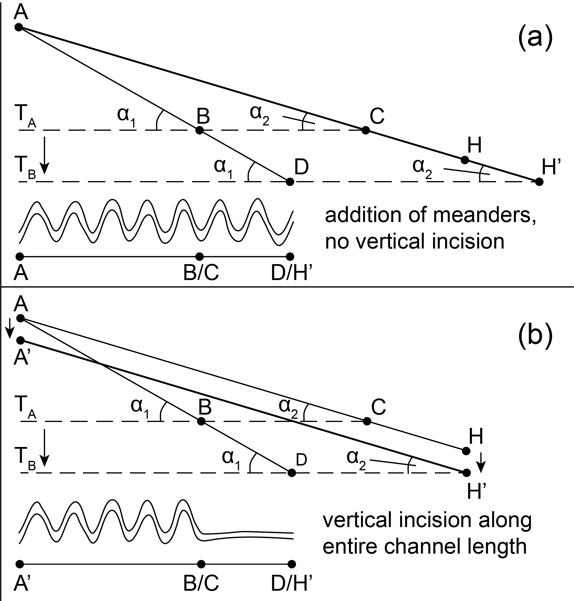

# Evaluating the spatio-temporal evolution of the sinuosity of channels cut by groundwater-fed springs using high-resolution satellite imagery
*Presentation of a method for creating time series of channel sinuosity evolution from satellite imagery, along with a brief description and interpretation of results from the Ghor Al-Haditha study site, eastern Dead Sea shore, Jordan.*

**Robert A. Watson**\
Department of Earth Sciences, University College Dublin, Ireland\
*robert.watson@ucd.ie*

## Summary

A method for calculating the sinuosity (ratio of centre-line length to valley length) of stream channels using satellite images from different timestamps is presented for an example case study in the area of Ghor Al-Haditha, Dead Sea eastern shore, Jordan. The method involves manually digitising the channel centreline 'thread' as a line shapefile for each timestamp in a GIS software package, and then calculating the sinuosity for each timestamp with a new Python library '*sinuutils*' written for the task. A moving window of fixed length is applied to interrogate each sinuosity timestamp spatially, with the channel profile resampled at 1 m intervals to normalise for length. Results obtained for the Dead Sea eastern shore site of Ghor Al-Haditha in Jordan are presented. At this site, channels cut by groundwater springs have evolved since the year 2000, apparently triggered by a decline in Dead Sea level (the local base level) and the synchronous retreat of the lake shoreline. 

## 1. Introduction

The morphology of single-thread river channels may be quantified by a series of parameters. These include: (1) the ratio between the channel’s bankfull width and the channel’s depth (*W/D* or aspect ratio); (2) the ratio between the pre-existing topographic slope (*Sv*) and the along-channel slope (*Sc*), and (3) the ratio between the straight-line length from a channels head to its mouth, commonly termed the valley length (*Lv*) and the channels entire centre-line length (*Lc*). These last two ratios are related to each other by the equation

$$\frac{L_c}{L_v} = \frac{S_v}{S_c} = P$$

Where *P* is the ‘total sinuosity’ of the channel in plan-form, with *P = 1* indicating a completely straight channel path and *P > 1.5* indicating high levels of sinuosity (Schumm, 1993). Streams of a high sinuosity therefore have a low channel gradient, as reported by Leopold and Wolman (1957). Ratzlaff (1991) redefined the ‘total sinuosity’ of a channel to be comprised of several components: ‘channel sinuosity’, ‘floodplain sinuosity’, ‘terrace sinuosity’ and ‘valley sinuosity’. If the channel does not form within a floodplain, ‘floodplain sinuosity’ and ‘terrace sinuosity’ do not require consideration and the ‘total sinuosity’ of a channel is merely the product of channel and valley sinuosity (as in Schumm’s (1993) definition). Flowing water does not necessarily consist of a single well-defined channel, but may also organise into a network of interacting channels, termed ‘braiding’ (Leopold & Wolman, 1957; Schumm et al., 1987). 

Changes in fluvial channel morphology in response to base level fall via downward incision and knickpoint migration or degradation of the channel banks have been proposed to depend on the rate and magnitude of base-level fall, the local relief and hydrological input, and the character of the channel substrate (Blum & Törnqvist, 2000; Leopold & Bull, 1979; Schumm, 1993; Simon & Rinaldi, 2006). An over-arching theme of all experimental studies is that channels will adjust to incremental base-level fall initially by vertical incision, and then by widening, to eventually reach an equilibrium, graded geometry after base-level fall ceases.

Schumm (1993) proposed that channels may evolve to base-level drop via planform pattern changes, such as increases or decreases in sinuosity, in addition to aggradation and degradation of the channel. Indeed, such planform changes may be the primary mechanism of adjustment. Schumm also suggested that the pattern adjustments of a channel due to base-level fall are only likely to be observed in the section of channel which forms on the newly uncovered surface exposed by the base-level fall, due to the large scale of these fluvial systems. The difference in length scale between the entire channel length and the horizontal retreat of base-level in these cases is very large, hence the ability of the base-level drop to affect channel morphology is attenuated upstream in these large fluvial systems. 
The conceptual adjustment of channel sinuosity in response to an increment of base-level drop, in the case of constant slope of the valley floor bathymetry, is presented in **Figure 1**. The concept is based upon that conceived by Schumm (1993), but with the important distinction that the scale of shoreline retreat in response to base-level fall is of a comparable scale to the length of the channel itself, whereas in previous studies the length of the channel or river has been orders of magnitude greater than the scale of shoreline retreat. If the channel is to preserve its initial slope (α2), either the channel lengthens further at the same sinuosity (adding meanders, such as in Figure 1a between H and H’) or it erodes downward (incises) along the entire length of the channel (such as in Figure 1b). Alternatively, upstream lengthening of the channel can occur via back-erosion of the channel head to preserve the sinuosity of the channel and to maintain channel slope. In the case of a variable valley floor slope, the channel will adjust differently: if the valley slope increases, sinuosity must increase in the new section of channel to preserve channel slope (Schumm, 1993). In the case of a significant decrease in valley slope, the channel will display a decrease in sinuosity in the channel reach on the newly exposed shelf, and may begin to deposit material to form an alluvial fan or delta (Schumm, 1993). 

**Figure 1.** Conceptual model of stream channel morphological response to base-level drop revealing a bathymetry of constant slope (α1) where the lithological properties of the material into which the channel is cut are uniform and homogeneous, modified from Schumm (1993). If the base-level falls by a given increment between time TA and TB, then the valley profile (AB) will increase by a given length (BD). The initial stream channel (AC) must increase in length by this amount as a minimum (BD = CH). The stream channel is hypothesised to respond to the base-level drop via two key mechanisms, both preserving the channel slope (α2): (a) adding meanders to the newly exposed valley floor until the new base-level is reached, of a length equivalent to HH’, or (b) incising along the channel length leading to a reduction in sinuosity, with the sinuosity reduction either distributed across the entire channel or only in parts of it (e.g. only in the newly developed reach of the channel, as shown here).

## 2. Methods

Here I first define some key terms in the approach used to quantify the morphological evolution of the meandering channels. The ‘valley length’ (Lv in equation (1)) is here defined after Brice (1964) who defines the ‘valley sinuosity’ as the difference between the gentle sinuous axis of a line following the trend of the channel as it meanders (the ‘meander belt’) and the straight-line distance between the head and mouth of the channel. In my analysis, I treat the ‘valley sinuosity’ or ‘meander belt axis’ to be a baseline for channel sinuosity in the absence of a topographical valley to constrain the channel limits (ie I consider the ‘meander belt axis’ to have a sinuosity of 1). Therefore, I define the ‘total sinuosity’ to be the ratio of total channel length ((Lc in equation (1)) and the length of the meander belt axis (here considered equivalent to Lv). Lc was measured by manually mapping the centreline of the channels, and Lv by manually determining the mean meander belt axis profile from visual inspection of the remote sensing data and the bathymetric contour data. The channel sinuosity was analysed in moving windows of a fixed length of 50m. A 50m window was determined to be the most suitable for subsequent interpretation. Plots of sinuosity for other window lengths are given in Appendix B. For ease of comparison and explanation of my results, channels were divided into ten reaches of equal length for each channel, with reach 1 that nearest the channel head and reach 10 that nearest the channel mouth.

## 3. Results

## 4. Discussion

## 5. Conclusions

## 6. References
