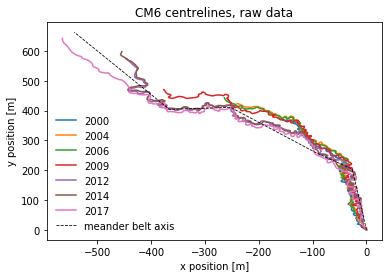
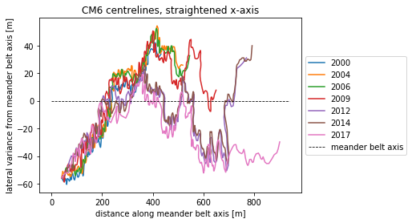
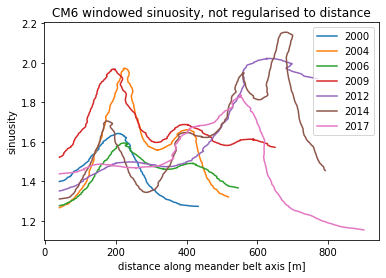
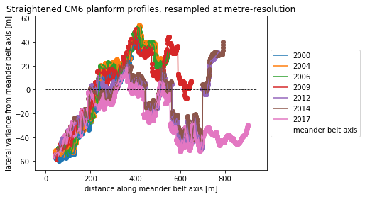
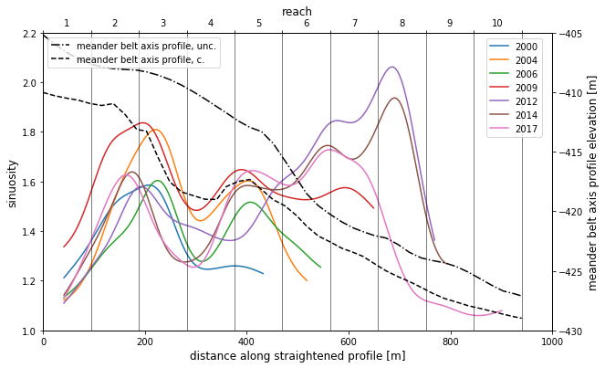
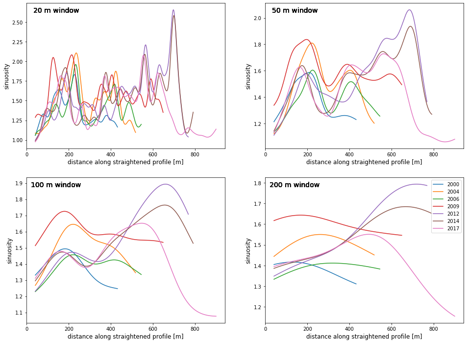

# SinuosiTime: workbench for analysis of the sinuosity of stream channels at Ghor Al-Haditha using shapefiles of channel centrelines digitised from high-resolution satellite imagery)

**Robert A. Watson**\
Department of Earth Sciences, University College Dublin, Ireland\
*robert.watson@ucd.ie*)

**Date**: 13.04.2020

### Dependencies:

- [Python 3](https://www.python.org/downloads/)
- [math (usually included in Python 3 standard library)](https://github.com/python/cpython/blob/master/Modules/mathmodule.c)
- [matplotlib](https://matplotlib.org/)
- [NumPy](https://numpy.org/)
- [pandas](https://pandas.pydata.org/)
- [PyShp](https://pypi.org/project/pyshp/) 
- [string (usually included in Python 3 standard library)](https://github.com/python/cpython/blob/2.7/Lib/string.py)

I recommend using the [Anaconda platform](https://www.anaconda.com/) as your coding environment to build/use this workflow. Another useful page might be the Python 3 standard library documentation, available [here](https://docs.python.org/3/library/index.html). To install a given Python package, run the following command:

*pip install <package_name>* 

or, if working in a conda environment

*conda install <package_name>* 

You will also need access to the [channel centreline and meander belt axis data](https://github.com/wobrotson/SinuosiTime/tree/master/sinuosity_shapefiles?raw=true) and the Python package [sinuutils](https://github.com/wobrotson/SinuosiTime/blob/master/python/sinuutils.py). Both are included within the Github repository [SinuosiTime](https://github.com/wobrotson/SinuosiTime).

## Import channel centreline and meander belt axis data and setup the workspace and dataframes for subsequent analysis


```python
from sinuutils import readshapestopandas

riverid = 6 # id of channel being analysed (CM_riverid)

channelname = '../sinuosity_shapefiles/sin_CM%d.shp' % riverid # define channel to be analysed
yearrivers = readshapestopandas(channelname)
# in yearrivers shapeid from readshapestopandas is the year that the profile was drawn
```


```python
# import shapefile which contains the valley slopes aka meander belt axis for different years

valleyslope = '../sinuosity_shapefiles/valley_slope_prof_wgs84.shp'

direct_profiles = readshapestopandas(valleyslope)

# in this shapefile, the 'shapeid' is not a year but the id of the channel
# call the correct channel id using riverid

direct_profile = None
for shapeid, d in direct_profiles:
    if shapeid == riverid:
        direct_profile = d

dp_head = direct_profile.head() # see first 5 lines of dataframe 
print(dp_head);
```

             lat        lng           x           y     segleng          ar
    0  31.316642  35.535948    0.000000    0.000000    0.000000    0.000000
    1  31.318469  35.535669  -26.486694  203.335550  205.053385  205.053385
    2  31.318990  35.534931  -96.670667  261.360416   91.064127  296.117512
    3  31.320331  35.533295 -252.313884  410.617813  215.644572  511.762084
    4  31.320270  35.532101 -365.853177  403.907083  113.737438  625.499523


## Plot centrelines for chosen channel for years analysed in space relative to position of channel head (assumed to be fixed)


```python
%matplotlib inline 
from matplotlib import pyplot as plt

for year, df in yearrivers:
    plt.plot(df.x, df.y, label='%d' % year)
    
plt.plot(direct_profile.x, direct_profile.y, color='k',linestyle='--',
         linewidth=0.8, label='meander belt axis')
plt.legend(loc='lower left',frameon=False)  
plt.title('CM%d centrelines, raw data' % riverid)
plt.xlabel('x position [m]')
plt.ylabel('y position [m]');
```





## Warp centrelines so that the meander belt axis behaves as the x-axis, meaning that sinuosity can be calculated relative to this only (simplifying code)


```python
from sinuutils import transaxis
from sinuutils import warptodirect
import numpy as np

fig = plt.figure(figsize=(9,4))
ax = plt.subplot(111)
box = ax.get_position()
    
for year, df in yearrivers: # calculate straightened channel profiles
    straightenedx, straightenedy, cwtx, cwty, r0, r1 = warptodirect(direct_profile, df)
    ax.plot(straightenedx, straightenedy, label="%d" % year)
    
transax = np.linspace(0,r1,10)
transay = np.zeros((10,), dtype=int)

ax.plot(transax, transay, color='k', linestyle='--', linewidth=0.8, label="meander belt axis")

box = ax.get_position()
ax.set_position([box.x0, box.y0, box.width*0.65, box.height])
legend_x = 1
legend_y = 0.5
plt.legend(loc='center left', bbox_to_anchor=(legend_x, legend_y))

plt.title('CM%d centrelines, straightened x-axis' % riverid)
plt.xlabel('distance along meander belt axis [m]')
plt.ylabel('lateral variance from meander belt axis [m]');
```





## Calculate windowed sinuosity of the river channel where windows are not regularised ie represent a pre-defined number of centreline segments as digitised in the shapefile


```python
from sinuutils import windowed_sinuosity

# calculate windowed sinuosity for each given year
for year, df in yearrivers:
    wxs, awsin = windowed_sinuosity(df)
    plt.plot(df.straightenedx,df.windowedsin, label='%d' %year)

plt.title('CM%d windowed sinuosity, not regularised to distance' % riverid)
plt.xlabel('distance along meander belt axis [m]')
plt.ylabel('sinuosity')
plt.legend();
```





## Resample the centrelines at metre-resolution so that distance along reach is consistent and regularised between different years


```python
from sinuutils import metre_interp
import pandas as pd

fig = plt.figure(figsize=(9,4))
ax = plt.subplot(111)
box = ax.get_position()

yearrivers_interp = [ ]
for year, df in yearrivers:
    xvals, yinterp = metre_interp(df.straightenedx, df.straightenedy)
    df2 = pd.DataFrame({"chan_xvals":xvals, "chan_yinterp":yinterp})
    vx2 = (df2.chan_xvals - df2.chan_xvals.shift()).fillna(0)
    vy2 = (df2.chan_yinterp - df2.chan_yinterp.shift()).fillna(0)
    df2["straightenedsegleng"] = np.sqrt(vx2**2 + vy2**2)
    yearrivers_interp.append((year, df2))
     
    #plt.plot(df.straightenedx, df.straightenedy, label="%d" % year)
for year, df2 in yearrivers_interp:
    ax.plot(df2.chan_xvals, df2.chan_yinterp, label='%d' %year)
    ax.scatter(df2.chan_xvals, df2.chan_yinterp)
    
ax.plot(transax, transay, color='k', linestyle='--', linewidth=0.8, label="meander belt axis")

box = ax.get_position()
ax.set_position([box.x0, box.y0, box.width*0.65, box.height])
legend_x = 1
legend_y = 0.5
plt.legend(loc='center left', bbox_to_anchor=(legend_x, legend_y))

plt.title('Straightened CM%d planform profiles, resampled at metre-resolution' % riverid)
plt.xlabel('distance along meander belt axis [m]')
plt.ylabel('lateral variance from meander belt axis [m]');
```





```python
yr_i = yearrivers_interp[:1]
print(yr_i); #example data for year 2000
```

    [(2000,      chan_xvals  chan_yinterp  straightenedsegleng
    0          41.0    -55.838104             0.000000
    1          42.0    -56.159110             1.050259
    2          43.0    -56.480115             1.050259
    3          44.0    -56.801121             1.050259
    4          45.0    -57.122126             1.050259
    ..          ...           ...                  ...
    387       428.0     32.590521             1.035140
    388       429.0     32.857944             1.035140
    389       430.0     33.125368             1.035140
    390       431.0     33.392791             1.035140
    391       432.0     33.660215             1.035140
    
    [392 rows x 3 columns])]


## Calculate windowed sinuosity: window length can now be expressed in metres (absolute distance) rather than relative position of nodes along centreline


```python
import matplotlib.ticker as ticker
from sinuutils import windowed_sin_interp
centreweightlength = 50 # width of window in metres: change as appropriate

fig = plt.figure(figsize = (10,6))
ax1 = plt.axes()

for year, df2 in yearrivers_interp:
    wxs, awsin = windowed_sin_interp(df2, centreweightlength)
    ax1.plot(df2.chan_xvals,df2.windowedsin, label='%d' %year)

ax1.set_xlim(0, 1000)
ax1.set_ylim(1, 2.2)
ax1.set_xlabel('distance along straightened profile [m]', fontsize=12)
ax1.set_ylabel('sinuosity', fontsize=12)

# read in meander belt axes profile

# dataframe for meander belt axis slopes
df3 = pd.read_csv('../sinuosity_shapefiles/corrected_bath_meander_belt_axes.csv', header=0)

for n in range(riverid,riverid+1): # get meander belt axis topography for specified channel id
    MBA = df3[df3.prof_id == n]

# plot channel reach as vertical guidelines    
reachx = np.linspace(0,MBA[-1:]['cds2d'],11)

for n in range (0, len(reachx)):
    ax1.axvline(x=reachx[n], color='k', linewidth=0.5)

# plot meander belt axis topography on right-hand y-axis
ax2 = ax1.twinx()

ax2.plot(MBA.cds2d, MBA.bathymetry, 'k-.', label='meander belt axis profile, unc.')
ax2.plot(MBA.cds2d, MBA.bathymetry_new, 'k--', label='meander belt axis profile, c.')

ax2.set_xlim(0, 1000)
ax2.set_ylim(-430, -405)
ax2.set_ylabel('meander belt axis profile elevation [m]', color='k', fontsize=12)
ax2.tick_params('y', colors='k')
ax1.legend(loc=[0.87, 0.65],fontsize=10)
ax2.legend(loc = 'upper left', fontsize=10)

# add reach to top x-axis 
ax3 = ax1.twiny()
ax3.set_xlim(ax1.get_xlim())
ax3.plot(range(1000), np.zeros(1000)) # Create a dummy plot
ax3.set_xlabel("reach", fontsize=12)

new_xtick_values = np.linspace(1,10,10)

# make the top x ticks integers, not floats
new_xtick_int = []

for each in new_xtick_values:
    new_xtick_int.append(int(each))

# plot reach values in centre of ticks
ax3.xaxis.set_major_locator(ticker.FixedLocator(reachx))

minor_tickloc = []
for val in reachx:
    minor_tickloc.append(val+(reachx[-1]/20))
    
ax3.xaxis.set_minor_locator(ticker.FixedLocator(minor_tickloc))


ax3.xaxis.set_major_formatter(ticker.NullFormatter())
ax3.xaxis.set_minor_formatter(ticker.FixedFormatter(new_xtick_int))

for tick in ax3.xaxis.get_minor_ticks():
    tick.tick1line.set_markersize(0)
    tick.tick2line.set_markersize(0)
    tick.label1.set_horizontalalignment('center');
```





## Demonstrate the sensitivity of channel sinuosity to different window lengths


```python
# plot channel sinuosity along length with different window lengths 

fig = plt.figure(figsize = (16,12))

window_tests = [20,50,100,200]

for n in range(0,4):
    ax = fig.add_subplot(2, 2, n+1)
    for year, df2 in yearrivers_interp:
        wxs, awsin = windowed_sin_interp(df2, window_tests[n])
        ax.plot(df2.chan_xvals,df2.windowedsin, label='%d' %year)
        ax.text(0.15, 0.95, '%d m window' %(window_tests[n]), 
                horizontalalignment='center',verticalalignment='center', 
                transform=ax.transAxes, fontsize=14)
        plt.xlabel('distance along straightened profile [m]', fontsize=12)
        plt.ylabel('sinuosity', fontsize=12)

plt.legend(loc = 'upper right');
```




